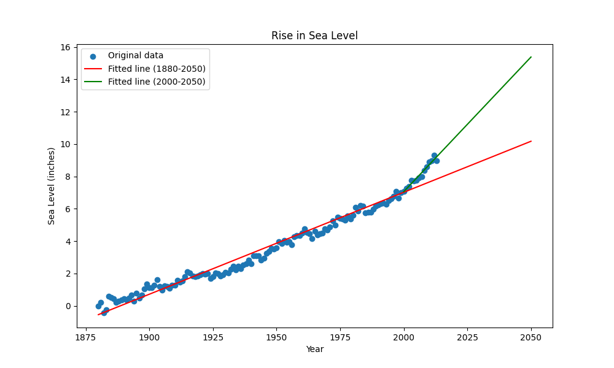

# Sea Level Predictor

This repository contains a Python script for analyzing sea level data and predicting future trends. The script generates a scatter plot with lines of best fit to visualize the data and predictions.

## Table of Contents
- [Introduction](#introduction)
- [Features](#features)
- [Installation](#installation)
- [Usage](#usage)
- [Output](#output)
- [Contributing](#contributing)

## Introduction

The **Sea Level Predictor** project uses a dataset containing sea level data to compute and visualize various statistics. This tool is useful for understanding the trends in sea levels and predicting future changes.

## Features

- Reads sea level data from a CSV file.
- Creates a scatter plot of the original data.
- Generates two lines of best fit: one for the entire dataset and one for data from the year 2000 onwards.
- Visualizes the predicted sea levels up to the year 2050.

## Installation

To use this project, you need to have Python, Pandas, Matplotlib, and SciPy installed on your system. You can install the required packages using pip:

\`\`\`bash
pip install pandas matplotlib scipy
\`\`\`

## Usage

1. Clone this repository to your local machine.
2. Ensure that you have the required dependencies installed.
3. Place the dataset file (\`epa-sea-level.csv\`) in the same directory as the script.
4. Run the script to generate and save the visualization.

## Output

The script will output the following visualization:

- Sea Level Plot:
  

## Contributing

Contributions are welcome! Please feel free to submit a Pull Request.

